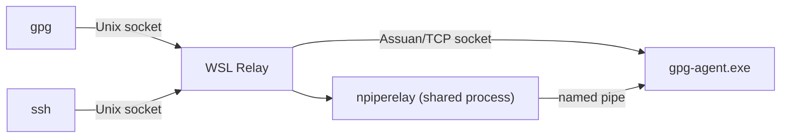
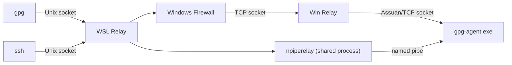
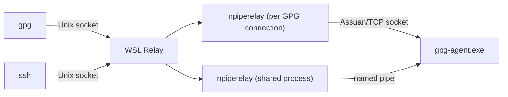

# GPG Relay for WSL1 and WSL2, written in Ruby

This utility forwards requests from gpg clients in WSL1 and WSL2 to
[Gpg4win](https://gpg4win.org/)'s gpg-agent.exe in Windows. It can also
forward ssh requests to gpg-agent.exe, when using a PGP key for ssh
authentication. It is especially useful when you store your PGP key on a
Yubikey, since WSL cannot share access to USB devices with Windows.

## Overview

This solution consists of two relay components:

- **WSL Relay** (`gpg_relay_wsl.rb`): Runs in WSL. Receives GPG and SSH
  requests through local Unix sockets, and relays to `gpg-agent.exe` through different channels.
- **Win Relay** (`gpg_relay_win.rb`): Runs in Windows. Only needed for WSL2 NAT
  mode. Receives requests over TCP and forwards them to `gpg-agent.exe`.

## Access and networking modes

Windows Subsystem for Linux (WSL) exists in two versions, WSL1 and WSL2. For WSL2, you can configure the
[networking mode](https://learn.microsoft.com/en-us/windows/wsl/wsl-config#main-wsl-settings) in `.wslconfig`, `NAT` or `mirrored`. `gpg-relay` supports three different modes that can be used in different situations:

| WSL version | Networking mode | gpg-relay mode |
|---|---|---|
| WSL1 | | `mirrored` or `npiperelay` |
| WSL2 | `NAT` | `nat` or `npiperelay` |
| WSL2 | `mirrored` | `mirrored` or `npiperelay` |

WSL Relay uses different methods of communication with `gpg-agent.exe` in Windows:

| WSL Relay mode | protocol | access mechanism |
|---|---|---|
| mirrored | GPG | direct TCP access to each Assuan socket |
| | SSH | multiplexing through npiperelay.exe to named pipe |
| NAT | GPG | relaying via Win Relay to each Assuan socket |
| | SSH | multiplexing through npiperelay.exe to named pipe |
| npiperelay | GPG | relaying through npiperelay.exe to Assuan sockets |
| | SSH | multiplexing through npiperelay.exe to named pipe |

### Access Modes

The WSL Relay supports three modes, selected with `--mode`:

**Direct access for WSL1 or WSL2 with mirrored networking** (`mirrored`):



WSL1 and WSL2 with mirrored networking can connect to gpg-agent.exe on 127.0.0.1 directly,
so no firewall changes or Win Relay are needed.

**WSL2 with NAT networking** (`nat`):



WSL2 in NAT mode has a different IP address than the Windows host, so
network traffic to Windows is external (public). The Win Relay must listen
on `0.0.0.0` and the three GPG ports must be proxied. A firewall rule
is required for the three GPG ports (see [Firewall and Security](#firewall-and-security)).

**npiperelay** (`npiperelay`):



This mode works in any WSL variant when Windows executable interop is
enabled. It does not need the Win Relay or a Windows Firewall rule. It
starts one `npiperelay` process per GPG client connection.

## Installation

### Prerequisites

1. Install [Gpg4Win](https://www.gpg4win.org). Gpg4win's' `gpgconf.exe` must be found on the PATH, both in Windows and WSL.
2. Install `npiperelay.exe`. It is recommended to use [albertony/npiperelay](https://github.com/albertony/npiperelay)
   that has support for Assuan sockets.

    a. Download `npiperelay.exe` to a location in Windows that can be accessed from WSL, e.g `C:\Program1`.
    
    b. Create a symlink in WSL, e.g. `sudo ln -s /mnt/c/Program1/npiperelay.exe /usr/local/bin/npiperelay`.

3. In WSL, `npiperelay`, `gpgconf`, `wslpath`, and `gpgconf.exe` must be found on the PATH.
4. If using the Win Relay in Windows, `npiperelay.exe` and `gpgconf.exe` must be found on the PATH.
5. Unpack the Ruby release into a Windows filesystem location reachable from
   both Windows and WSL, such as `C:\Program1\gpgrelay`.
6. From the unpacked release directory, install dependencies in each runtime:

   ```bash
   bundle install
   ```

   The Ruby implementation requires the `sys-proctable` gem listed in the
   repository's `Gemfile`.

7. To enable relaying of SSH requests, you must enable `enable-ssh-support` and `enable-win32-openssh-support` for
   Gpg4win's gpg-agent.exe. The WSL Relay multiplexes all SSH client requests through one `npiperelay` process for
   Gpg4win's `//./pipe/openssh-ssh-agent`.


### Systemd Socket Activation

The recommended way to run the WSL Relay is via systemd socket activation. This
eliminates the need for manual startup scripts and provides better startup
ordering and resource management.

The [systemd](systemd) folder contains examples of running
`gpg_relay_wsl.rb` under systemd. Update the `ExecStart` command with the path
and executable used in your installation.

#### Installing systemd units

1. Copy the systemd unit files to your user systemd directory:

   ```bash
   mkdir -p ~/.config/systemd/user
   cp systemd/*.socket systemd/*.service ~/.config/systemd/user/
   ```

2. Reload the systemd user daemon:

   ```bash
   systemctl --user daemon-reload
   ```

3. Enable the gpg-relay-agent socket units:

   ```bash
   systemctl --user enable --now gpg-relay-agent.socket gpg-relay-agent-extra.socket gpg-relay-agent-browser.socket gpg-relay-agent-ssh.socket
   ```

4. Mask the upstream gpg-agent service and socket units if they should not be
   started by the current user:

   ```bash
   systemctl --user mask gpg-agent.service gpg-agent.socket gpg-agent-browser.socket gpg-agent-extra.socket gpg-agent-ssh.socket
   ```

The service will now automatically start when any of the GPG sockets are
accessed. The four sockets are:

- `S.gpg-agent` - Main GPG agent socket
- `S.gpg-agent.browser` - Browser GPG agent socket
- `S.gpg-agent.extra` - Extra GPG agent socket
- `S.gpg-agent.ssh` - SSH GPG agent socket

### Configuration

The systemd service file can be customized by creating a drop-in override:

```bash
systemctl --user edit gpg-relay-agent.service
```

For example, to change the access mode or enable SSH support:

```ini
[Service]
ExecStart=/usr/bin/ruby /mnt/c/Program1/gpgrelay/gpg_relay_wsl.rb --systemd --enable-ssh-support --mode=mirrored
```

## Usage

### WSL Relay

```bash
ruby /mnt/c/Program1/gpgrelay/gpg_relay_wsl.rb --help
```

The Ruby executable uses the long options supported by `OptionParser`.
Supported flags are `--mode`, `--enable-ssh-support`, `--remote-address`,
`--port`, `--noncefile`, `--logfile`, `--pidfile`, `--systemd`, and
`--log-level`. Defaults are mirrored mode, port 6910, SSH disabled, and WARN
logging. The default remote address is the NAT gateway in NAT mode and
127.0.0.1 otherwise; an explicit `--remote-address` takes precedence.
The `npiperelay` mode does not use the remote address.

### Win Relay

```bash
ruby C:\Program1\gpgrelay\gpg_relay_win.rb --help
```

Start `gpg_relay_win.rb` independently on Windows for NAT mode. It listens
for GPG traffic on the three ports beginning at `--port` (default 6910).
Its flags are `--port`, `--noncefile`, `--log-level`, `--windows-address`,
`--windows-logfile`, and `--windows-pidfile`. The default listening address
is 127.0.0.1; use `--windows-address=0.0.0.0` for WSL2 NAT traffic and
configure the Windows firewall as described below. The nonce file defaults
to `gpg_relay.nonce` in the Windows GPG home directory.

### Mode Selection

- **`mirrored`** (default): Use this mode when running in WSL1 or when WSL2 is configured
  with mirrored networking. No firewall changes or Win Relay are needed.
- **`nat`**: Use this mode when WSL2 is configured with NAT networking.
  Requires a Windows Firewall rule (see [Firewall rules](#firewall-rules)).
- **`npiperelay`**: Use this mode with any WSL networking configuration to reach GPG through Windows executable interop.
  No Win Relay is needed. While this works in all situations, it starts an npiperelay process for every request, so it
  is less efficient than `mirrored` mode.

When the mode is set to `nat`, the remote address is automatically
detected from the default gateway. In `mirrored` mode, it defaults to
`127.0.0.1`. An explicit `--remote-address` takes precedence.

## Firewall and Security

### Firewall Rules


Specifically, add an incoming rule for the Public profile that allows
connections from `172.16.0.0/12` and `192.168.0.0/16` to TCP ports
`6910-6912` (or the three ports starting at the custom `--port`).

### Authentication

The private IP address ranges listed above are used by WSL2, but could also be used by computers on your local LAN. To
limit access to the Win Relay, a simple nonce authentication scheme similar to Assuan sockets is used. The Win Relay
stores a nonce in a file that should only be accessible by the user. By default it saves the file in the GPG home
directory in Windows. The WSL Relay reads the nonce from the file and sends it to the Win Relay to authenticate.

This ensures that only local processes that can read the nonce file can
authenticate with the Win Relay. Other connections will fail, which means
that connections from other computers on the LAN will be rejected.

## A note about gpg-agent.exe and its support for SSH

1. The ssh Assuan port does not appear to work. gpg-agent.exe closes the connection immediately after receiving the request.

2. The PuTTY Pageant protocol works, but requires getting a handle on a hidden window, which requires a program to be running in Windows. It cannot be done from WSL.

3. `enable-win32-openssh-support` instructs gpg-agent.exe to create the
Windows Named Pipe, which can be used
to handle ssh-agent requests with the help of npiperelay. However, the
implementation appears to be limited: gpg-agent.exe cannot handle multiple
simultaneous requests. If multiple npiperelay processes are started at the
same time, most of them will fail to connect with "pipe busy" errors, and
gpg-agent.exe does not appear to recover. The solution to this is to keep
one single npiperelay process running that can multiplex SSH requests from
multiple clients and return the responses.

## Tips when using Remote Desktop

If you are using RDP to a remote host, RDP can redirect the local Yubikey
smartcard to the remote host, so that the remote gpg-agent.exe can access
it.

Sometimes the Yubikey smartcard will be blocked on the local host so that
the remote host cannot access it. When that happens the solution is to
remove the Yubikey and insert it again, while an RDP session is active.
This allows RDP to grab the smartcard.

An alternative to re-inserting the Yubikey is to restart some local
services to free the Yubikey for use on the remote host. The
[rdp_yubikey.cmd](../utils/rdp_yubikey.cmd) batch command automates stopping
and/or restarting local processes. It must be run as Administrator.
